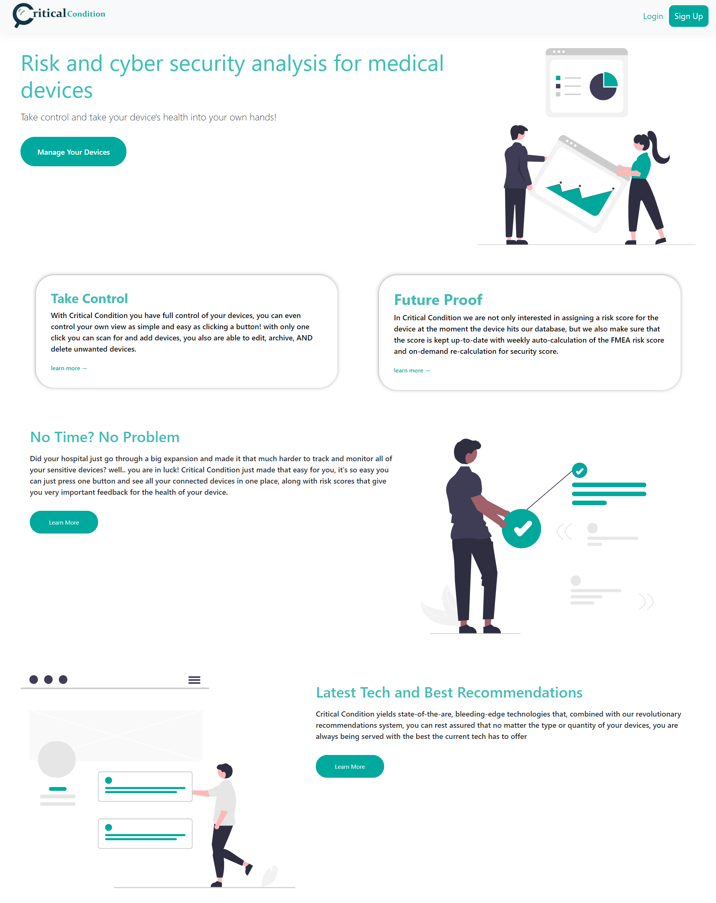
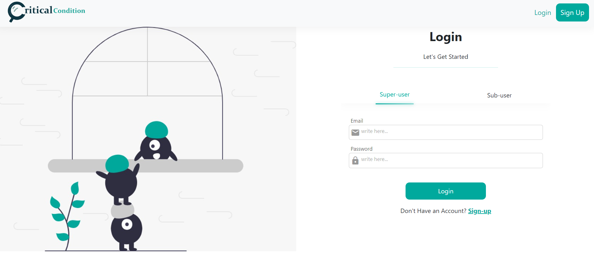
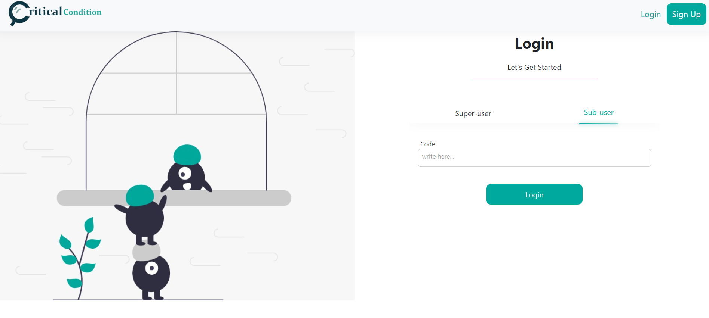
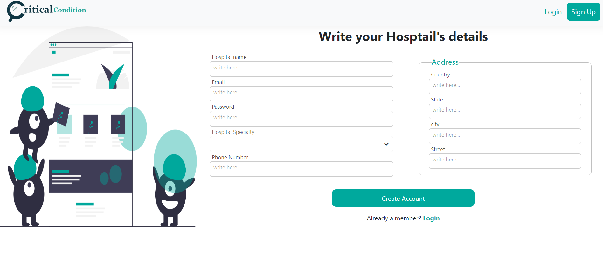
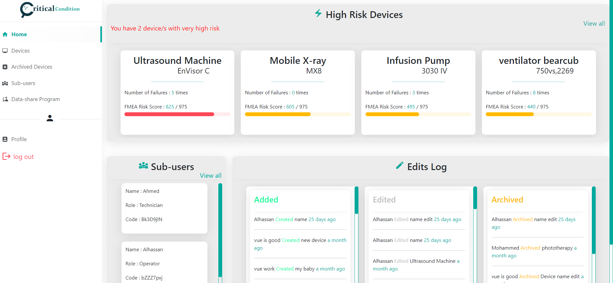

<p align="center">
  
</p>

<h1 align="center">
What is Critical Condition
</h1>

### "Risk and Cyber Security Analysis for Medical Devices in a Hospital Environment (Critical Condition)" was submitted as a graduation project for the bachelor's degree of FCIS at Mansoura University in 2022.
It's a Progressive, fully responsive Web Application that targets hospitals and healthcare facilities, to make it easier for them to track and monitor all their devices in one place while giving them crucial information in the form of a risk score that each device holds. Making the decesion making easier for device managers as well as hospital management.

<hr />

<p align="right">
  <sub>
    Instructions for running the project locally are at the very bottom of this readme
  </sub>
</p>

<h3 align="center">
  pictures of the web-application are presented below: 
</h3>

### Landing Page: 


### Login Page: 



### Sign-Up Page: 


### Super-User Home Page: 


### Full Work-Flow 
https://user-images.githubusercontent.com/52916146/181118694-945ccc80-c85f-45ca-91ae-b9677f926ab8.mp4

<hr />

## Project setup

```
npm install
```

### Compiles and hot-reloads for development
```
npm run serve
```
